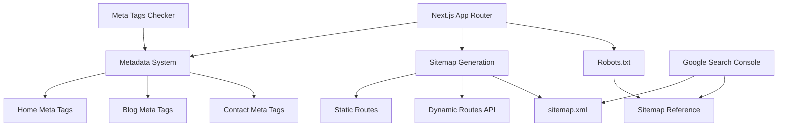

# Design Document: Meta Tags and Sitemap Validation

## Overview

This design document outlines the implementation of dynamic meta tags across three pages (Home, Blog, Contact) and a dynamic sitemap system with Google Search Console validation support. The solution uses Next.js App Router's Metadata API and built-in sitemap generation capabilities.

## Architecture

### High-Level Architecture



### Design Decisions

1. **Metadata API over `<Head>`**: Use Next.js 13+ Metadata API (modern approach for App Router)
2. **Built-in Sitemap**: Use `app/sitemap.ts` convention for automatic XML generation
3. **Static robots.txt**: Use `public/robots.txt` for crawler directives
4. **Extensible Architecture**: Design sitemap to support future database/CMS integration
5. **Production URLs**: Use environment variables for deployment flexibility

## Components and Interfaces

### 1. Page Metadata Configuration

**Locations**: 
- `app/page.tsx` (Home)
- `app/blog/page.tsx` (Blog)
- `app/contacto/page.tsx` (Contact)

**Interface**:
```typescript
import { Metadata } from 'next';

export const metadata: Metadata = {
  title: string,
  description: string,
  keywords: string[],
  openGraph: {
    title: string,
    description: string,
    images: Array<{
      url: string,
      width: number,
      height: number,
      alt: string,
    }>,
    type: 'website',
  },
};
```

**Responsibilities**:
- Define unique title for each page (50-60 characters)
- Provide SEO-optimized descriptions (150-160 characters)
- Configure Open Graph tags for social sharing
- Include relevant keywords for search engines

**Design Rationale**: The Metadata API automatically generates proper `<head>` tags without manual `<Head>` component usage, providing type safety and better performance.

### 2. Sitemap Generation System

**Location**: `app/sitemap.ts`

**Interface**:
```typescript
import { MetadataRoute } from 'next';

export default function sitemap(): MetadataRoute.Sitemap {
  return Array<{
    url: string,
    lastModified: Date,
    changeFrequency: 'always' | 'hourly' | 'daily' | 'weekly' | 'monthly' | 'yearly' | 'never',
    priority: number,
  }>;
}
```

**Responsibilities**:
- Generate XML sitemap with all public routes
- Include metadata (lastModified, changeFrequency, priority)
- Support static and dynamic route merging
- Follow sitemap.org protocol standards

**Design Rationale**: Next.js automatically converts the return value to proper XML format, eliminating manual XML generation and potential formatting errors.

### 3. Dynamic Routes API Structure

**Location**: `app/sitemap.ts` (extended)

**Interface**:
```typescript
async function fetchDynamicRoutes(): Promise<DynamicRoute[]> {
  // Fetch from database or CMS
  return routes;
}

export default async function sitemap(): MetadataRoute.Sitemap {
  const staticRoutes = [...];
  const dynamicRoutes = await fetchDynamicRoutes();
  return [...staticRoutes, ...dynamicRoutes];
}
```

**Responsibilities**:
- Fetch dynamic content from database/CMS
- Transform database records to sitemap entries
- Handle API failures gracefully
- Cache results for performance

**Design Rationale**: Async function support allows database queries without blocking, and the merge pattern keeps static routes always available even if dynamic fetch fails.

### 4. Robots.txt Configuration

**Location**: `public/robots.txt`

**Format**:
```
User-agent: *
Allow: /

Sitemap: https://[production-url]/sitemap.xml
```

**Responsibilities**:
- Define crawler access rules
- Reference sitemap location
- Use production URL for deployment

**Design Rationale**: Static file approach is simple and follows web standards. Served directly by Next.js without processing overhead.

## Data Models

### Page Metadata Structure

```typescript
interface PageMetadata {
  title: string; // 50-60 characters
  description: string; // 150-160 characters
  keywords: string[];
  openGraph: {
    title: string;
    description: string;
    images: Array<{
      url: string;
      width: 1200;
      height: 630;
      alt: string;
    }>;
    type: 'website' | 'article';
  };
}
```

### Sitemap Entry Structure

```typescript
interface SitemapEntry {
  url: string; // Full URL including domain
  lastModified: Date;
  changeFrequency: 'always' | 'hourly' | 'daily' | 'weekly' | 'monthly' | 'yearly' | 'never';
  priority: number; // 0.0 to 1.0
}
```

### Dynamic Route Structure

```typescript
interface DynamicRoute {
  slug: string;
  updatedAt: Date;
  type: 'blog' | 'product' | 'page';
}
```

## Error Handling

### Metadata Errors
- **Missing fields**: Provide fallback values from root layout
- **Invalid format**: TypeScript catches at compile time
- **Image loading**: Use placeholder if OG image unavailable

### Sitemap Generation Errors
- **Database unavailable**: Return static routes only
- **Invalid URLs**: Sanitize and validate before adding
- **Timeout**: Set reasonable timeout for dynamic fetches

### Google Search Console Errors
- **Verification failure**: Provide alternative verification methods
- **Sitemap not found**: Ensure proper deployment and URL configuration
- **Indexing issues**: Document troubleshooting steps

## Testing Strategy

### Unit Testing
- Test metadata object structure for each page
- Validate sitemap entry format
- Test URL sanitization functions
- Verify priority and frequency values

### Integration Testing
- Verify meta tags appear in rendered HTML
- Test sitemap.xml endpoint returns valid XML
- Validate robots.txt content and format
- Test dynamic route merging logic

### Validation Testing
- **Meta Tags Checker**: Validate all three pages
- **XML Validator**: Validate sitemap format
- **Google Search Console**: Submit and verify sitemap
- **Social Media Debuggers**: Test OG tags on Facebook/Twitter

### Manual Testing
- Inspect `<head>` tags in browser DevTools
- View sitemap.xml in browser
- Test robots.txt accessibility
- Verify Google Search Console integration

## Implementation Notes

### SEO Best Practices
1. **Unique Titles**: Each page must have unique, descriptive title
2. **Description Length**: Keep between 150-160 characters
3. **Keywords**: Use 5-10 relevant keywords per page
4. **OG Images**: Always 1200x630px for optimal social sharing
5. **Sitemap Priority**: Homepage = 1.0, important pages = 0.8, others = 0.5-0.7

### Google Search Console Setup
1. Add property with production URL
2. Verify ownership (DNS, HTML file, or meta tag)
3. Submit sitemap.xml
4. Monitor indexing status
5. Check for errors regularly

### Environment Configuration
- `NEXT_PUBLIC_SITE_URL`: Production URL for sitemap and OG tags
- Must be set in deployment environment (Vercel, etc.)
- Used for absolute URL generation

### Performance Considerations
- Sitemap generation should complete in < 1 second
- Cache dynamic routes for 5-10 minutes
- Limit database queries to essential data only
- Use CDN for OG images

## Google Search Console Integration

### Verification Methods
1. **HTML File Upload**: Upload verification file to `public/`
2. **Meta Tag**: Add verification meta tag to root layout
3. **DNS Record**: Add TXT record to domain DNS
4. **Google Analytics**: Link existing GA property

### Sitemap Submission Process
1. Navigate to Sitemaps section
2. Enter `sitemap.xml` in the input field
3. Click "Submit"
4. Wait 24-48 hours for initial crawl
5. Monitor "Coverage" report for indexed pages

### Monitoring and Maintenance
- Check sitemap status weekly
- Review coverage reports for errors
- Update sitemap when adding new pages
- Monitor Core Web Vitals in Search Console
- Track search performance metrics
