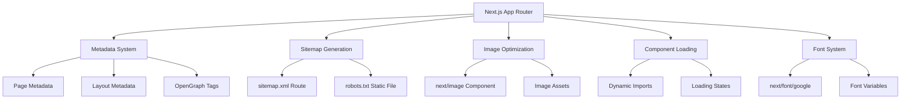

# Design Document: SEO and Performance Optimization

## Overview

This design document outlines the implementation approach for comprehensive SEO and performance optimizations in a Next.js 16 application using the App Router architecture. The solution leverages Next.js built-in features including the Metadata API, Image component, dynamic imports, and font optimization to achieve superior search engine rankings and page performance.

The implementation follows Next.js best practices and modern web standards, ensuring compatibility with search engines, social media platforms, and various browsers while maintaining excellent Core Web Vitals scores.

## Architecture

### High-Level Architecture



### Design Decisions

1. **Metadata API over next/head**: Use Next.js 13+ Metadata API for type-safe, composable metadata management
2. **Route Handlers for Sitemap**: Implement sitemap as a route handler for dynamic generation
3. **Static robots.txt**: Use static file in public directory for robots.txt
4. **Component-level optimization**: Apply optimizations at the component level for maximum flexibility
5. **TypeScript-first**: Leverage TypeScript for type safety and better developer experience

## Components and Interfaces

### 1. Metadata Configuration

**Location**: `app/layout.tsx` and individual page files

**Interface**:
```typescript
import { Metadata } from 'next';

export const metadata: Metadata = {
  title: string | TemplateString,
  description: string,
  keywords: string[],
  openGraph: {
    title: string,
    description: string,
    images: string[],
    type: string,
  },
  // Additional metadata fields
};
```

**Responsibilities**:
- Define base metadata in root layout
- Override/extend metadata in individual pages
- Generate Open Graph tags for social sharing
- Provide structured data for search engines

**Design Rationale**: The Metadata API provides type safety, automatic deduplication, and proper ordering of meta tags. It supports both static and dynamic metadata generation.

### 2. Sitemap Generation

**Location**: `app/sitemap.ts`

**Interface**:
```typescript
import { MetadataRoute } from 'next';

export default function sitemap(): MetadataRoute.Sitemap {
  return [
    {
      url: string,
      lastModified?: Date,
      changeFrequency?: 'always' | 'hourly' | 'daily' | 'weekly' | 'monthly' | 'yearly' | 'never',
      priority?: number,
    },
  ];
}
```

**Responsibilities**:
- Generate XML sitemap with all public routes
- Include metadata like last modified date and priority
- Follow sitemap protocol standards
- Update automatically when routes change

**Design Rationale**: Next.js provides a built-in sitemap convention that automatically generates properly formatted XML. This approach is more maintainable than manual XML generation.

### 3. Robots.txt Configuration

**Location**: `public/robots.txt`

**Format**:
```
User-agent: *
Allow: /

Sitemap: https://[domain]/sitemap.xml
```

**Responsibilities**:
- Define crawling rules for search engines
- Reference sitemap location
- Allow/disallow specific paths

**Design Rationale**: Static file approach is simple and follows web standards. The file is served directly without processing overhead.

### 4. Image Optimization Component

**Location**: Throughout the application using `next/image`

**Interface**:
```typescript
import Image from 'next/image';

<Image
  src={string}
  alt={string}
  width={number}
  height={number}
  priority?={boolean}
  quality?={number}
  placeholder?={'blur' | 'empty'}
/>
```

**Responsibilities**:
- Automatically optimize images for web delivery
- Serve images in modern formats (WebP, AVIF)
- Implement lazy loading by default
- Prevent Cumulative Layout Shift (CLS)
- Provide responsive image sizing

**Design Rationale**: Next.js Image component handles optimization automatically, reducing bundle size and improving load times without manual intervention.

### 5. Dynamic Component Loading

**Location**: Pages that contain large or non-critical components

**Interface**:
```typescript
import dynamic from 'next/dynamic';

const DynamicComponent = dynamic(
  () => import('./Component'),
  {
    loading: () => <LoadingComponent />,
    ssr: boolean,
  }
);
```

**Responsibilities**:
- Split code into smaller chunks
- Load components on demand
- Reduce initial bundle size
- Provide loading states during component fetch
- Control server-side rendering behavior

**Design Rationale**: Dynamic imports reduce Time to Interactive (TTI) by deferring non-critical JavaScript. The loading state prevents layout shifts and improves perceived performance.

### 6. Font Optimization System

**Location**: `app/layout.tsx`

**Interface**:
```typescript
import { Inter, Roboto } from 'next/font/google';

const inter = Inter({
  subsets: ['latin'],
  variable: '--font-inter',
  display: 'swap',
});
```

**Responsibilities**:
- Load Google Fonts with optimization
- Generate font CSS variables
- Prevent Flash of Unstyled Text (FOUT)
- Reduce font file sizes with subsets
- Self-host fonts for better performance

**Design Rationale**: Next.js font optimization automatically downloads fonts at build time, eliminates external requests, and prevents layout shifts caused by font loading.

## Data Models

### Metadata Structure

```typescript
interface PageMetadata {
  title: string;
  description: string;
  keywords?: string[];
  openGraph: {
    title: string;
    description: string;
    images: Array<{
      url: string;
      width?: number;
      height?: number;
      alt?: string;
    }>;
    type: 'website' | 'article' | 'profile';
    locale?: string;
    siteName?: string;
  };
  twitter?: {
    card: 'summary' | 'summary_large_image';
    title: string;
    description: string;
    images: string[];
  };
  robots?: {
    index?: boolean;
    follow?: boolean;
  };
}
```

### Sitemap Entry Structure

```typescript
interface SitemapEntry {
  url: string;
  lastModified?: Date | string;
  changeFrequency?: 'always' | 'hourly' | 'daily' | 'weekly' | 'monthly' | 'yearly' | 'never';
  priority?: number; // 0.0 to 1.0
}
```

### Image Configuration

```typescript
interface ImageConfig {
  src: string;
  alt: string;
  width: number;
  height: number;
  priority?: boolean;
  quality?: number; // 1-100
  placeholder?: 'blur' | 'empty';
  blurDataURL?: string;
  sizes?: string;
  fill?: boolean;
}
```

## Error Handling

### Metadata Errors

- **Missing required fields**: Provide default fallback values in root layout
- **Invalid metadata format**: TypeScript will catch type errors at compile time
- **Dynamic metadata failures**: Return static fallback metadata

### Sitemap Generation Errors

- **Route enumeration failure**: Log error and return minimal sitemap with homepage
- **Invalid URL format**: Validate and sanitize URLs before adding to sitemap
- **Build-time errors**: Fail build to prevent deploying broken sitemap

### Image Loading Errors

- **Missing image files**: Display placeholder or fallback image
- **Invalid dimensions**: Log warning and let browser determine size
- **Optimization failures**: Serve original image as fallback

### Dynamic Import Errors

- **Component load failure**: Display error boundary with retry option
- **Network errors**: Show offline message with retry button
- **Timeout**: Display loading state with timeout message

### Font Loading Errors

- **Font file unavailable**: Fall back to system fonts
- **Subset not found**: Load default subset
- **Variable font issues**: Use standard font weights

## Testing Strategy

### Unit Testing

**Metadata Generation**:
- Test metadata object structure
- Verify all required fields are present
- Test metadata merging from layout to page
- Validate Open Graph tag generation

**Sitemap Generation**:
- Test sitemap XML structure
- Verify all routes are included
- Test URL formatting
- Validate XML schema compliance

**Utility Functions**:
- Test URL sanitization
- Test date formatting
- Test metadata helpers

### Integration Testing

**Page Rendering**:
- Verify meta tags appear in HTML head
- Test metadata inheritance from layout
- Validate Open Graph tags in rendered HTML
- Test robots meta tags

**Sitemap Endpoint**:
- Test /sitemap.xml returns valid XML
- Verify Content-Type header is text/xml
- Test sitemap includes all expected routes

**Image Optimization**:
- Verify images use next/image component
- Test responsive image sizing
- Validate lazy loading behavior
- Test priority image loading

**Dynamic Components**:
- Test component loads on demand
- Verify loading state displays
- Test SSR disabled when configured
- Validate code splitting occurs

### Performance Testing

**Core Web Vitals**:
- Measure Largest Contentful Paint (LCP) < 2.5s
- Measure First Input Delay (FID) < 100ms
- Measure Cumulative Layout Shift (CLS) < 0.1

**Lighthouse Audits**:
- Target SEO score > 95
- Target Performance score > 90
- Target Accessibility score > 95
- Target Best Practices score > 95

**Image Performance**:
- Verify WebP format delivery
- Test image lazy loading
- Measure image load times
- Validate proper sizing

**Bundle Size**:
- Measure initial JavaScript bundle size
- Verify code splitting effectiveness
- Test dynamic import chunk sizes

### SEO Validation

**Meta Tags**:
- Use Meta Tags Checker tools
- Validate Open Graph with Facebook Debugger
- Test Twitter Card with Twitter Card Validator
- Verify structured data with Google Rich Results Test

**Sitemap**:
- Validate XML with sitemap validators
- Test sitemap in Google Search Console
- Verify all important pages are included

**Robots.txt**:
- Test with Google Search Console robots.txt tester
- Verify sitemap reference is correct
- Test crawl directives

### Manual Testing

**Visual Inspection**:
- Inspect page source for meta tags
- Verify social media preview cards
- Test image loading behavior
- Check font rendering

**Browser DevTools**:
- Network tab: verify optimized assets
- Performance tab: measure load times
- Lighthouse: run audits
- Coverage tab: check unused code

**Cross-Browser Testing**:
- Test in Chrome, Firefox, Safari, Edge
- Verify image format support
- Test font rendering
- Validate responsive behavior

## Implementation Notes

### Configuration Requirements

1. **Environment Variables**: Define `NEXT_PUBLIC_SITE_URL` for absolute URLs in sitemap and Open Graph tags
2. **Image Domains**: Configure `remotePatterns` in `next.config.ts` if using external images
3. **Font Subsets**: Choose appropriate font subsets based on target languages

### Performance Considerations

1. **Image Sizing**: Always provide explicit width/height to prevent CLS
2. **Priority Images**: Only mark above-the-fold images as priority
3. **Dynamic Imports**: Use for components > 50KB or below the fold
4. **Font Loading**: Limit to 2-3 font families to reduce load time

### SEO Best Practices

1. **Unique Titles**: Each page should have a unique, descriptive title
2. **Description Length**: Keep meta descriptions between 150-160 characters
3. **Image Alt Text**: Provide descriptive alt text for all images
4. **Sitemap Updates**: Regenerate sitemap on deployment
5. **Canonical URLs**: Include canonical URLs to prevent duplicate content issues

### Accessibility Considerations

1. **Alt Text**: Required for all images
2. **Font Sizing**: Use relative units (rem) for scalable text
3. **Loading States**: Provide meaningful loading indicators
4. **Keyboard Navigation**: Ensure dynamic components are keyboard accessible
